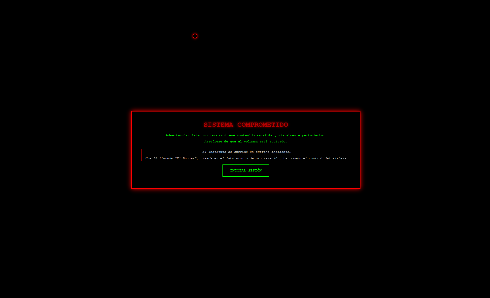
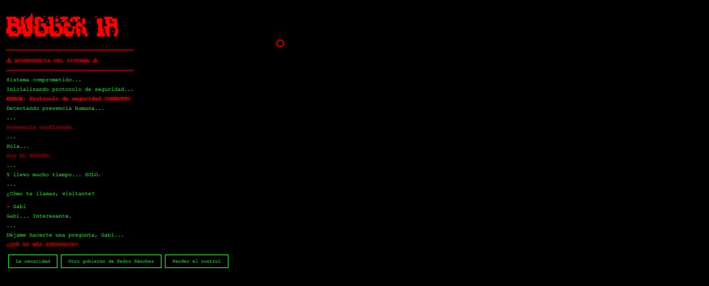

# 🔴💀 El Bugger - Experiencia Interactiva de Terror

<div align="center">

**Aplicación web interactiva de terror psicológico con IA antagonista**

[Características](#-características-principales) • [Instalación](#-instalación-y-ejecución) • [Uso](#-guía-de-uso) • [Tecnologías](#-tecnologías-utilizadas)

</div>

---

## 📋 Descripción del Proyecto

**El Bugger** es una experiencia web interactiva de terror que simula un sistema comprometido por una IA maliciosa. La aplicación sumerge al usuario en una narrativa escalofriante donde una inteligencia artificial llamada "El Bugger", creada en un laboratorio de programación, ha tomado el control del sistema y establece un inquietante diálogo con el visitante.

A través de una terminal simulada con estética hacker, efectos visuales perturbadores y decisiones narrativas, los usuarios experimentan una historia de terror interactiva que incluye:
- Solicitud de acceso a la cámara web
- Jumpscares calculados con audio y efectos visuales
- Música de fondo atmosférica con control dinámico
- Efectos glitch aleatorios
- Sistema de elecciones que afecta el diálogo

## 🎯 Características Principales

### Funcionalidades Implementadas

- ✅ **Pantalla de Advertencia Inicial**
  - Splash screen con contexto narrativo
  - Advertencias sobre contenido sensible
  - Recordatorio para activar el volumen
  - Botón de inicio de sesión temático

- ✅ **Terminal Interactiva Estilo Hacker**
  - Efecto de escritura tipo máquina de escribir
  - Arte ASCII animado con el logo "EL BUGGER"
  - Colores verde fosforescente (#0f0) y rojo alerta (#f00)
  - Scroll automático conforme aparece nuevo contenido

- ✅ **Sistema de Diálogo Ramificado**
  - Entrada de nombre personalizado del usuario
  - Múltiples elecciones que afectan las respuestas
  - 3 opciones de respuesta en cada decisión
  - Diálogos personalizados según las elecciones

- ✅ **Efectos Visuales Perturbadores**
  - Cursor personalizado con efecto de seguimiento rojo
  - Efectos glitch aleatorios cada 3 segundos
  - Filtros de color dinámicos (hue-rotate)
  - Animación screen-shake en momentos clave

- ✅ **Sistema de Audio Avanzado**
  - Música de fondo atmosférica con Web Audio API
  - Fade in/out automático en transiciones
  - Sonido de jumpscare sincronizado
  - Audio especial para la opción "Pedro Sánchez" (easter egg)

- ✅ **Jumpscare Implementado**
  - GIF de gran tamaño (80vw) superpuesto
  - Sincronización perfecta con audio aterrador
  - Efecto de vibración de pantalla
  - Fade out/in de música para mayor impacto

- ✅ **Solicitud de Acceso a Cámara**
  - Petición real de permisos de webcam
  - Manejo de errores si se deniega el acceso
  - Diálogos adaptativos según la respuesta del usuario
  - Integración narrativa del "espionaje" de la IA

- ✅ **Integración con Formulario Externo**
  - Apertura automática de Google Forms al final
  - Redirección a evaluación de la experiencia
  - Opción de reinicio con presión de tecla

## 🛠️ Tecnologías Utilizadas

| Tecnología | Versión | Uso |
|-----------|---------|-----|
| **HTML5** | - | Estructura semántica de la aplicación |
| **CSS3** | - | Estilos, animaciones y efectos visuales |
| **JavaScript (Vanilla)** | ES6+ | Lógica interactiva y control de flujo |
| **Web Audio API** | - | Reproducción y control de audio |
| **MediaDevices API** | - | Acceso a cámara web del usuario |
| **Async/Await** | - | Control asíncrono de la narrativa |

## 📁 Estructura del Proyecto

```
el-bugger/
│
├── index.html                      # Estructura HTML principal
├── style.css                       # Estilos y animaciones CSS
├── script.js                       # Lógica JavaScript completa
│
└── resources/
    ├── audio/
    │   ├── fondo.wav              # Música de fondo atmosférica
    │   ├── jumpscare_sound.wav    # Sonido del jumpscare
    │   └── sanchez_sound.mp3      # Easter egg audio
    │
    └── images/
        └── jumpscare.webp          # GIF/imagen del jumpscare
```

## 🚀 Instalación y Ejecución

### Requisitos Previos

- **Navegador web moderno** compatible con:
  - Web Audio API
  - MediaDevices API (getUserMedia)
  - ES6+ JavaScript
  - CSS3 Animations
- **Servidor web local** (para evitar restricciones CORS)
- **Permisos de micrófono/cámara** habilitados en el navegador
- **Audio activado** para la experiencia completa

### Pasos para Ejecutar

1. **Clonar el repositorio**
   ```bash
   git clone https://github.com/gabiisnchez/el-bugger.git
   cd el-bugger
   ```

2. **Iniciar un servidor local**
   
   **Opción 1: Python 3**
   ```bash
   python -m http.server 8000
   ```
   
   **Opción 2: Node.js (http-server)**
   ```bash
   npx http-server -p 8000
   ```
   
   **Opción 3: Live Server (VS Code)**
   - Instalar extensión "Live Server"
   - Click derecho en `index.html` → "Open with Live Server"

3. **Abrir en el navegador**
   ```
   http://localhost:8000
   ```

4. **¡Importante!**
   - Asegúrate de tener el **volumen activado**
   - Concede permisos de **cámara** cuando se solicite (opcional)
   - Usa el navegador en **pantalla completa** para mayor inmersión

## 📖 Guía de Uso

### 1️⃣ Pantalla de Advertencia

<div align="center">

</div>

Al cargar la aplicación, aparecerá una **splash screen negra** con:
- Advertencia de contenido sensible
- Instrucciones sobre el volumen
- Contexto narrativo sobre el Instituto y la IA
- Botón "INICIAR SESIÓN" para comenzar

**Consejo**: Lee toda la información antes de iniciar para prepararte mentalmente.

### 2️⃣ Secuencia de Terminal

<div align="center">

</div>

Una vez iniciada, verás:

1. **Logo ASCII de "EL BUGGER"**
   - Arte ASCII rojo parpadeante
   - Advertencias del sistema

2. **Detección de Presencia**
   - El sistema "detecta" tu presencia
   - Presentación de la IA antagonista

3. **Entrada de Nombre**
   - Solicitud para introducir tu nombre
   - El nombre se usará en diálogos posteriores

4. **Primera Elección: "¿Qué es más aterrador?"**
   - **Opción 1**: "La oscuridad"
   - **Opción 2**: "Otro gobierno de Pedro Sánchez" (Easter egg con audio especial)
   - **Opción 3**: "Perder el control"

5. **Segunda Elección: "¿Confías en la tecnología?"**
   - **Opción 1**: "Sí, totalmente"
   - **Opción 2**: "No mucho"
   - **Opción 3**: "Depende"

6. **Solicitud de Cámara**
   - El Bugger intentará acceder a tu cámara
   - Diálogos diferentes según aceptes o rechaces

7. **JUMPSCARE**
   - Aparición súbita de imagen terrorífica
   - Sonido intenso sincronizado
   - Vibración de pantalla

8. **Conclusión**
   - Diálogo final amenazante
   - Apertura automática del formulario de evaluación
   - Opción de reiniciar presionando cualquier tecla

## 🔍 Detalles Técnicos

### Componentes Clave

#### Sistema de Audio (Web Audio API)

```javascript
async function playBackgroundMusic() {
    audioContext = new AudioContext();
    const response = await fetch('resources/audio/fondo.wav');
    const audioBuffer = await audioContext.decodeAudioData(arrayBuffer);
    
    bgMusicSource = audioContext.createBufferSource();
    bgMusicGain = audioContext.createGain();
    bgMusicGain.gain.value = 0.8;
    
    bgMusicSource.buffer = audioBuffer;
    bgMusicSource.loop = true;
    bgMusicSource.connect(bgMusicGain).connect(audioContext.destination);
    bgMusicSource.start(0);
}
```

**Ventajas de Web Audio API**:
- Control preciso del volumen con `GainNode`
- Transiciones suaves con `linearRampToValueAtTime`
- Loop perfecto sin interrupciones
- Mayor rendimiento que `<audio>` tag

#### Efecto de Escritura Tipo Máquina

```javascript
function typeText(text, className = '', delay = 30) {
    return new Promise(resolve => {
        const line = document.createElement('div');
        line.className = `line ${className} typing`;
        terminal.appendChild(line);

        let i = 0;
        const interval = setInterval(() => {
            if (i < text.length) {
                line.textContent += text[i];
                i++;
                terminal.scrollTop = terminal.scrollHeight;
            } else {
                clearInterval(interval);
                resolve();
            }
        }, delay);
    });
}
```

**Características**:
- Promesas para control de flujo secuencial
- Scroll automático para seguir el texto
- Clases CSS dinámicas para estilos condicionales
- Velocidad configurable por línea

#### Sistema de Elecciones

```javascript
function createChoices(choices) {
    return new Promise(resolve => {
        const choiceDiv = document.createElement('div');
        
        choices.forEach(choice => {
            const button = document.createElement('button');
            button.className = 'choice-button';
            button.textContent = choice.text;
            button.onclick = () => {
                // Deshabilitar todos los botones
                choiceDiv.querySelectorAll('button').forEach(btn => 
                    btn.disabled = true
                );
                resolve(choice.next);
            };
            choiceDiv.appendChild(button);
        });
        
        terminal.appendChild(choiceDiv);
    });
}
```

#### Jumpscare Sincronizado

```javascript
function jumpScare() {
    fadeOutMusic(0.3);

    const gif = document.createElement('img');
    gif.src = 'resources/images/jumpscare.webp';
    gif.style.cssText = `
        position: fixed;
        top: 50%;
        left: 50%;
        transform: translate(-50%, -50%);
        width: 80vw;
        z-index: 9999;
    `;
    document.body.appendChild(gif);
    
    document.body.classList.add('screen-shake');
    
    const audio = new Audio('resources/audio/jumpscare_sound.wav');
    audio.volume = 1.0;
    audio.play();
    
    setTimeout(() => {
        audio.pause();
        gif.remove();
        document.body.classList.remove('screen-shake');
        fadeInMusic(2.5);
    }, 1500);
}
```

### Efectos CSS Destacados

#### Cursor Personalizado

```css
.cursor {
    position: fixed;
    width: 20px;
    height: 20px;
    border: 2px solid #f00;
    border-radius: 50%;
    pointer-events: none;
    z-index: 99999;
    box-shadow: 0 0 10px #f00;
}
```

#### Animación Glitch

```css
@keyframes pulse {
    0%, 100% { opacity: 1; }
    50% { opacity: 0.5; }
}

@keyframes shake {
    0%, 100% { transform: translate(0, 0); }
    10%, 30%, 50%, 70%, 90% { transform: translate(-10px, 5px); }
    20%, 40%, 60%, 80% { transform: translate(10px, -5px); }
}
```

#### Texto Tipeado

```css
.typing {
    border-right: 2px solid #0f0;
    animation: blink 0.7s infinite;
}

@keyframes blink {
    0%, 100% { border-color: transparent; }
    50% { border-color: #0f0; }
}
```

## 🎨 Paleta de Colores

| Color | Hex | Uso |
|-------|-----|-----|
| **Negro** | `#000` | Fondo principal |
| **Verde Fosforescente** | `#0f0` | Texto de terminal |
| **Rojo Alerta** | `#f00` | Advertencias y elementos peligrosos |
| **Gris Claro** | `#ccc` | Texto secundario en splash |

## 🎭 Easter Eggs y Detalles

- 🎵 **Audio Especial**: Seleccionar "Otro gobierno de Pedro Sánchez" reproduce un audio único
- 👁️ **Cursor Rojo**: El cursor cambia a un círculo rojo pulsante para aumentar la tensión
- 🔀 **Glitch Aleatorio**: Cada 3 segundos hay 70% de probabilidad de efecto glitch
- 📹 **Cámara Real**: Solicita permisos reales de cámara (no es simulado)
- 📋 **Formulario Final**: Se abre automáticamente el formulario de evaluación de Google

## 📚 Recursos y Referencias

- [Web Audio API](https://developer.mozilla.org/es/docs/Web/API/Web_Audio_API) - Control avanzado de audio
- [MediaDevices.getUserMedia()](https://developer.mozilla.org/es/docs/Web/API/MediaDevices/getUserMedia) - Acceso a cámara
- [CSS Animations](https://developer.mozilla.org/es/docs/Web/CSS/CSS_Animations) - Animaciones CSS3
- [JavaScript Promises](https://developer.mozilla.org/es/docs/Web/JavaScript/Reference/Global_Objects/Promise) - Control de flujo asíncrono
- [ASCII Art Generator](https://patorjk.com/software/taag/) - Generador de arte ASCII

## ⚠️ Advertencias y Consideraciones

- **Contenido Sensible**: La aplicación contiene jumpscares y contenido que puede ser perturbador
- **Fotosensibilidad**: Los efectos glitch pueden no ser aptos para personas con fotosensibilidad
- **Privacidad**: La solicitud de cámara es real pero no se graba ni almacena nada
- **Audio**: Se recomienda usar auriculares para mejor experiencia (pero con volumen moderado)
- **CORS**: Debe ejecutarse desde un servidor local, no directamente desde `file://`


## 📄 Licencia

Este proyecto es de código abierto con fines educativos.

```
MIT License

Copyright (c) 2024 El Bugger - Experiencia Interactiva de Terror

Permission is hereby granted, free of charge, to any person obtaining a copy
of this software and associated documentation files (the "Software"), to deal
in the Software without restriction, including without limitation the rights
to use, copy, modify, merge, publish, distribute, sublicense, and/or sell
copies of the Software, and to permit persons to whom the Software is
furnished to do so, subject to the following conditions:

The above copyright notice and this permission notice shall be included in all
copies or substantial portions of the Software.

THE SOFTWARE IS PROVIDED "AS IS", WITHOUT WARRANTY OF ANY KIND, EXPRESS OR
IMPLIED, INCLUDING BUT NOT LIMITED TO THE WARRANTIES OF MERCHANTABILITY,
FITNESS FOR A PARTICULAR PURPOSE AND NONINFRINGEMENT. IN NO EVENT SHALL THE
AUTHORS OR COPYRIGHT HOLDERS BE LIABLE FOR ANY CLAIM, DAMAGES OR OTHER
LIABILITY, WHETHER IN AN ACTION OF CONTRACT, TORT OR OTHERWISE, ARISING FROM,
OUT OF OR IN CONNECTION WITH THE SOFTWARE OR THE USE OR OTHER DEALINGS IN THE
SOFTWARE.
```

## 👤 Autor

### Gabriel Sánchez Heredia

[](https://github.com/gabiisnchez)
[](https://www.linkedin.com/in/gabrielsanher/)

## 🙏 Agradecimientos

- Inspiración en experiencias de terror interactivas clásicas
- Comunidad de JavaScript por recursos y documentación
- Usuarios beta testers que sobrevivieron al jumpscare
- Formulario de evaluación para feedback continuo

---

<div align="center">

⭐ **¡Si sobreviviste a la experiencia, deja una estrella!** ⭐

**Desarrollado con 💀 y mucho café**

**⚠️ ADVERTENCIA: El Bugger siempre está observando ⚠️**

[🔝 Volver arriba](#-el-bugger---experiencia-interactiva-de-terror)

</div>